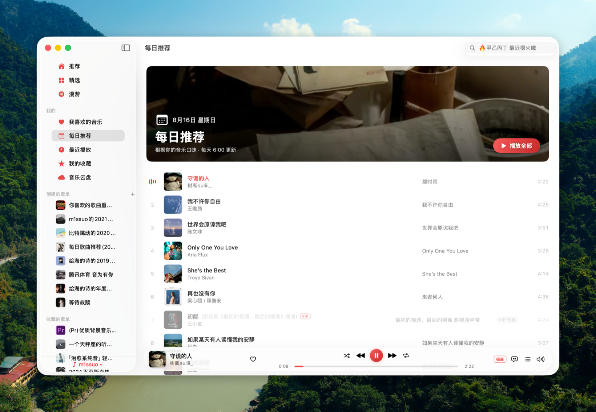

<div align="center">


# Kumone

**雲の音 — 原生 macOS 网易云音乐客户端**

SwiftUI 编写 · 零第三方依赖 · 直连网易云真实 API

[](#构建)
[](Package.swift)
[](LICENSE)



</div>

## 功能

- 🔐 **扫码登录** — 网易云 App 扫码，Cookie 本地持久化，自动续期
- 🏠 **推荐** — 每日推荐、私人漫游、心动模式、推荐歌单、排行榜、新碟上架、推荐歌手
- 🧭 **精选** — 分类歌单（精品 / 官方 / 排行榜 / 场景分类）无限滚动
- 🎵 **播放** — AVPlayer 引擎，标准 ~ Hi-Res 音质可选（黑胶 VIP 可播无损，自动回落），随机 / 单曲循环 / 列表循环，下一首播放队列，灰色歌曲识别
- 🔓 **灰色歌曲解锁** — 原生实现 UnblockNeteaseMusic 核心音源（pyncmd / 酷我 / 酷狗），无版权或试听歌曲自动匹配第三方音源
- 🖼 **沉浸播放页** — 封面取色渐变背景 + 大封面 + 大字同步歌词（点击播放条封面进入，Esc 退出）
- 📻 **私人漫游** — 沉浸式 FM 页面，不喜欢 / 切歌
- 📝 **歌词** — 侧边玻璃面板，逐行同步 + 翻译，点击跳转
- 📚 **音乐库** — 我喜欢的音乐、创建 / 收藏的歌单、收藏专辑、关注歌手、最近播放、音乐云盘
- ✏️ **歌单管理** — 新建 / 删除 / 收藏歌单、添加 / 移除歌曲、红心
- 🔍 **搜索** — 综合 / 单曲 / 歌手 / 专辑 / 歌单，热搜词占位
- ⌨️ **系统集成** — 媒体键 / 控制中心（Now Playing）、听歌打卡、退出后恢复播放队列

## 构建

要求 macOS 15+、Xcode 26+。

```bash
swift build                    # 编译
Scripts/build-app.sh           # 打包 .app（输出 .build/app/Kumone.app）
Scripts/compile_and_run.sh     # 杀进程 → 重新打包 → 启动
```

## 架构

```
Sources/Kumone/
├── Core/
│   ├── API/            # NeteaseCrypto（weapi/eapi 加密）、NeteaseClient（传输 + Cookie）、NeteaseAPI（约 50 个端点）
│   ├── Models/         # 统一 Track 模型（兼容新旧两种 JSON 格式）、歌词解析器
│   ├── Player/         # PlayerService（队列 / 随机 / 循环 / FM / URL 解析）、UnblockService、NowPlayingManager
│   └── Storage/        # AccountStore、SettingsManager、两级图片缓存
├── DesignSystem/       # 设计 token、按钮样式（hover 缩放 / 行高亮 / chip）、骨架屏、卡片、跑马灯、封面取色
└── Features/           # 各页面 + 播放条 + 沉浸播放页 + 歌词/队列面板
```

不依赖任何第三方 API 服务器：weapi（AES-CBC 双层 + RSA）与 eapi（AES-ECB + MD5 摘要）加密为原生 Swift 实现，请求直达 `music.163.com` / `interface.music.163.com`。

## Credits

Kumone 是从零编写的 Swift 实现，未复制以下项目的代码，但深度参考了它们的设计与实现思路，在此致谢：

- [YesPlayMusic](https://github.com/qier222/YesPlayMusic)（MIT，© qier222）— 功能设计、网易云 API 端点与行为逻辑的参考
- [kaset](https://github.com/sozercan/kaset)（MIT，© sozercan）— UI 设计系统、动效与 SwiftPM 打包方案的参考
- [UnblockNeteaseMusic/server](https://github.com/UnblockNeteaseMusic/server)（LGPL-3.0-only）— 灰色歌曲第三方音源的接口与匹配策略参考（`UnblockService.swift` 为独立的 Swift 重新实现）

## 协议与说明

本项目以 [LGPL-3.0-only](LICENSE) 协议开源（随附 [GPL-3.0](COPYING) 文本）。仅供学习交流，音乐数据与版权归网易云音乐及各音源平台所有。不支持下载、无社交功能。
